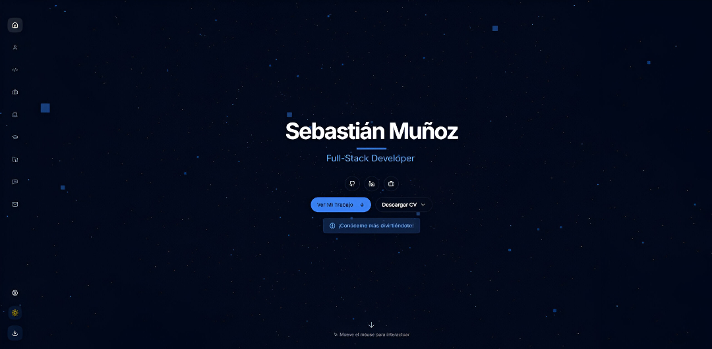

# Portfolio de Sebastián Muñoz - Desarrollador Full Stack




## 📋 Descripción

Portfolio profesional interactivo que muestra mis habilidades, experiencia, proyectos y servicios como desarrollador Full Stack. Diseñado con un enfoque moderno, animaciones fluidas y una experiencia de usuario atractiva.

## 🌐 Demo en vivo

Visita mi portafolio en [mi sitio web](https://portfolio-plxyz08s-projects.vercel.app/) para conocer más sobre mis proyectos y habilidades.

## ✨ Características Principales

- **Diseño Responsivo**: Experiencia óptima en dispositivos móviles, tablets y escritorio
- **Modo Oscuro/Claro**: Cambio de tema con persistencia en localStorage
- **Animaciones Fluidas**: Implementadas con Framer Motion para transiciones suaves
- **Mini-Juego Interactivo**: Quiz de programación para una experiencia interactiva
- **Visualización 3D**: Fondo animado con Three.js
- **Formulario de Contacto**: Con validación y notificaciones
- **Secciones Completas**: Experiencia, habilidades, educación, proyectos y testimonios
- **Optimización SEO**: Meta etiquetas y estructura semántica

## 🛠️ Tecnologías Utilizadas

- **Framework**: Next.js 14 (App Router)
- **Lenguaje**: TypeScript
- **Estilos**: Tailwind CSS
- **Componentes UI**: shadcn/ui
- **Animaciones**: Framer Motion
- **3D**: Three.js
- **Iconos**: Lucide React
- **Formularios**: React Hook Form
- **Validación**: Zod
- **Notificaciones**: React Hot Toast

## 📂 Estructura del Proyecto

Dentro de la carpeta `components/` encontrarás todos los componentes que forman este portafolio.

---

¡Gracias por pasarte por mi portafolio! 😄

## Desarrollado con ❤️ por Sebastián Muñoz

## 🚀 Cómo Ejecutar

Para ejecutar el proyecto, simplemente clona el repositorio y corre los siguientes comandos:

```bash
npm install
npm start
